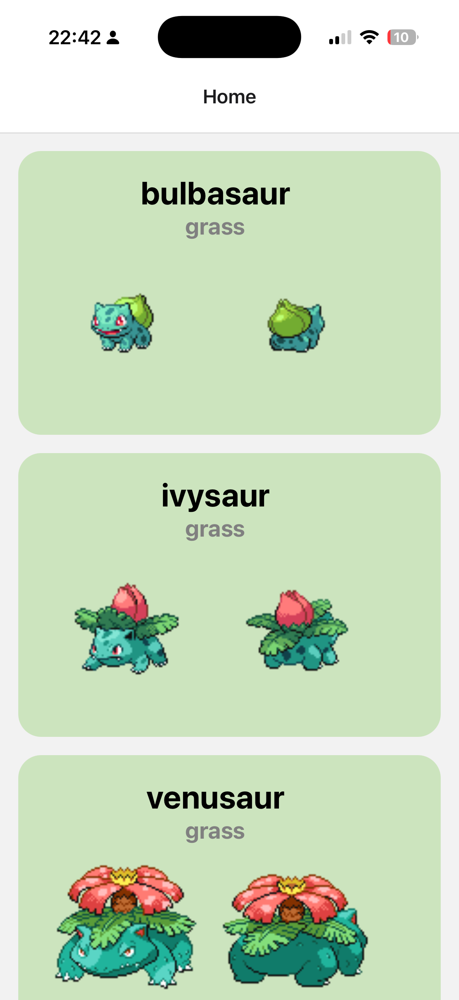
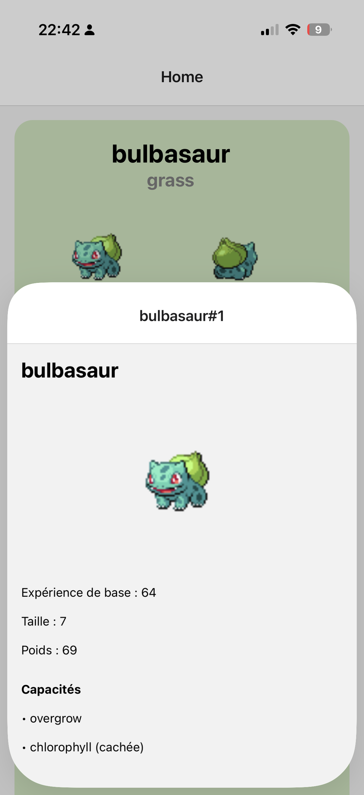

# Un mini Pokedex

## Images d'exemple ✅

Voici les deux images d'exemple, affichées côte à côte et redimensionnées :

<table>
  <tr>
    <td></td>
    <td></td>
  </tr>
</table>


This is an [Expo](https://expo.dev) project created with [`create-expo-app`](https://www.npmjs.com/package/create-expo-app).

## Get started

1. Install dependencies

   ```bash
   npm install
   ```

2. Start the app

   ```bash
   npx expo start
   ```